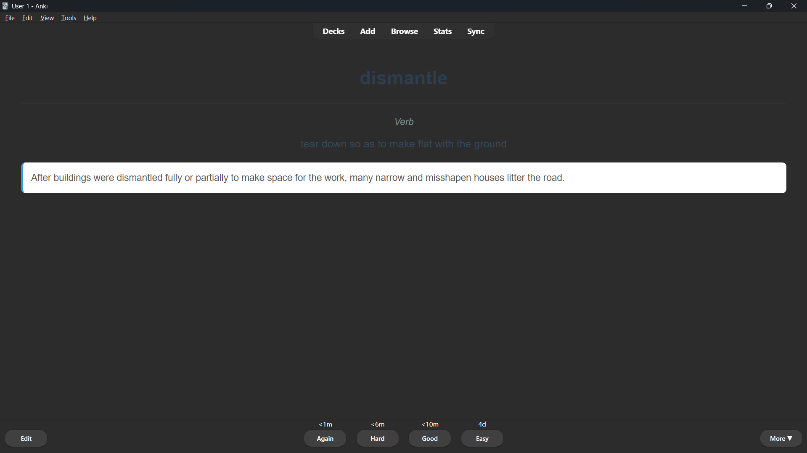

# LexiFlash

LexiFlash is a vocabulary extraction project with a legacy hybrid Python + Rust CLI and a Rust-native desktop app. The CLI still generates ready-to-import Anki flashcards (`.apkg`), while the desktop app work lives under `lexiflash_app/`.



## 🌟 Key Features

- **Smart Scraping**: Built-in support for **VnExpress (English)** and **BBC News**, featuring a robust retry mechanism with exponential backoff and randomized User-Agents to prevent blocking.
- **Local File Parsing**: Extract vocabulary from `.txt`, `.docx`, `.pptx`, and `.pdf` files using the same downstream NLP pipeline as web scraping.
- **Context-Aware NLP**: 
  - **POS Tagging**: Utilizes `nltk.pos_tag` to understand the grammatical context of each word.
  - **Smart Lemmatization**: Performs accurate base-form reduction based on Part-of-Speech.
  - **Context-Aware Definitions**: Fetches the most relevant WordNet definitions matching the word's usage in the sentence.
- **Hybrid Architecture**: Integrates a Rust-powered core via PyO3 for ultra-fast text filtering and processing, combining Python's flexibility with Rust's high-performance memory-safe execution.
- **Optimized Anki UX**: Implements **Smart Context Truncation** to keep flashcards readable while ensuring the target word remains perfectly centered in its context.
- **Accented Character Support**: Correctly processes loanwords and names with accents (e.g., *café*, *résumé*).
- **Modern Workflow**: Managed by `uv` for lightning-fast dependency management and consistent environments. Supports Python 3.10+.
- **Automated Blacklist**: Effortlessly manage your `known_words.txt` via CLI flags to skip words you've already mastered.
- **CI/CD Ready**: Fully integrated with GitHub Actions for automated testing and quality assurance.

## 🛠️ Installation

This project uses [uv](https://github.com/astral-sh/uv) for Python environment and dependency management.

This project uses a Rust-based engine for high-performance text processing.

1. **Clone the repository**:
   ```bash
   git clone https://github.com/QinZinn/lexiflash.git
   cd lexiflash
   ```

2. **Sync dependencies**:
   ```bash
   uv sync
   ```

3. **Build and install the Rust engine**:
   ```bash
   cd lexianki_rs
   uv run maturin build --release -o ../dist_rs
   cd ..
   uv pip install dist_rs/*.whl
   ```

## 🚀 Usage

Run the tool from the repository root using `uv run`.

### Basic Command
```bash
uv run main.py --url "https://e.vnexpress.net/news/news/education/vietnam-wins-four-gold-medals-at-international-chemistry-olympiad-4775486.html"
```

### Local File Input
The `--file` flag accepts local `.txt`, `.docx`, `.pptx`, and `.pdf` files.

```bash
uv run main.py --file "/path/to/article.docx"

# Parse slides from a PowerPoint deck
uv run main.py --file "/path/to/lesson-slides.pptx"

# Parse text from a PDF document
uv run main.py --file "/path/to/report.pdf"
```

### Custom Output & Export
You can customize the output filename, limit the number of words, or export to CSV:

```bash
# Limit to 30 words and export to CSV
uv run main.py --url "https://..." --max-words 30 --export-csv "my_words.csv"

# Custom Anki output filename
uv run main.py --url "https://..." --output "custom_deck.apkg"
```

### Managing Known Words
Automate the update of `known_words.txt` to streamline your learning process:

- **Auto-mark as known**: Append all extracted words from an article to your blacklist after generation.
  ```bash
  uv run main.py --url "https://..." --mark-known
  ```
- **Manual add**: Add a list of words directly to the blacklist and exit.
  ```bash
  uv run main.py --add-known "essential, remarkable, challenge"
  ```

### Arguments
- `--url`: The URL of the news article to process.
- `--file`: Path to a local `.txt`, `.docx`, `.pptx`, or `.pdf` file to process.
- `--output`: (Optional) The name of the output `.apkg` file.
- `--mark-known`: (Optional) Automatically add extracted words to `known_words.txt`.
- `--add-known`: (Optional) A comma-separated list of words to add to `known_words.txt`.
- `--max-words`: (Optional) Maximum number of words to extract (e.g., `30`).
- `--export-csv`: (Optional) Filename to export vocabulary to CSV.
- Exactly one of `--url` or `--file` must be provided for a pipeline run.

## 🧪 Testing

The project includes a comprehensive test suite for NLP processing and truncation logic.

```bash
uv run test_processor.py
```

## 📂 Project Structure

```text
LexiFlash/
├── .github/workflows/       # CI/CD (GitHub Actions)
├── main.py                  # CLI Entry Point
├── test_processor.py        # Unit Tests
├── known_words.txt          # Vocabulary Blacklist
├── pyproject.toml           # uv Configuration
├── src/                     # Python Core Package
│   ├── __init__.py
│   ├── scraper.py           # Robust Scraper (Retries, Fake UA)
│   ├── processor.py         # POS Tagging, Rust-backed filtering/truncation
│   ├── dictionary_lookup.py # Context-aware WordNet lookup
│   ├── anki_generator.py    # .apkg Generation
│   ├── file_parser.py       # Local .txt/.docx/.pptx/.pdf parsing to scraper-compatible schema
│   └── exporter.py          # CSV Export Logic
├── lexianki_rs/             # Legacy Rust extension for the Python CLI
├── lexiflash_nlp/           # Rust-native NLP crate for the desktop pipeline
├── lexiflash_app/           # Dioxus desktop application
├── assets/                  # Documentation Assets
└── README.md                # Project Documentation
```

## 📄 License
MIT License. See [LICENSE](LICENSE) for details.
